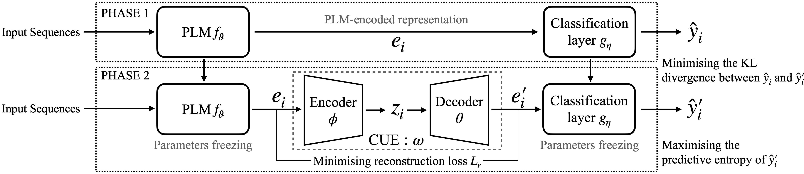

# CUE: An Uncertainty Interpretation Framework for Text Classifiers Built on Pre-Trained Language Models


Authors: Jiazheng Li, Zhaoyue Sun, Bin Liang, Lin Gui and Yulan He

## Abstract

Text classifiers built on Pre-trained Language Models (PLMs) have achieved remarkable progress in various tasks including sentiment analysis, natural language inference, and question-answering. However, the occurrence of uncertain predictions by these classifiers poses a challenge to their reliability when deployed in practical applications. Much effort has been devoted to designing various probes in order to understand what PLMs capture. But few studies have delved into factors influencing PLM-based classifiers' predictive uncertainty. In this paper, we propose a novel framework, called CUE, which aims to interpret uncertainties inherent in the predictions of PLM-based models. In particular, we first map PLM-encoded representations to a latent space via a variational auto-encoder. We then generate text representations by perturbing the latent space which causes fluctuation in predictive uncertainty. By comparing the difference in predictive uncertainty between the perturbed and the original text representations, we are able to identify the latent dimensions responsible for uncertainty and subsequently trace back to the input features that contribute to such uncertainty. Our extensive experiments on four benchmark datasets encompassing linguistic acceptability classification, emotion classification, and natural language inference show the feasibility of our proposed framework.

<p align="center">

</p>

## Getting Started

Project structure:
```
	Counterfactuals-for-Sentiment-Analysis
	├── README.md
	├── resources
	├── .gitignore
	├── environment.yml     # Conda environment     
	├── train.py            # Train language models/ CUE framework
    ├── test.py             # Test fine-tuned models
    ├── analysis.py         # Generate latent dimension analysis
	└── uncertain
	    ├── __init__.py
	    ├── constants.py    
	    ├── dataloader.py
	    ├── models
        │   └── ...
	    └── evaluation
            └── ...
```

### Creating an environment from an environment.yml file

```python
conda env create -f environment.yml
```

### Define the path you save models

In the ```constants.py```, you will find two constant paths defined at the top:
```python
DATAFOLDER = "/path/to/the/folder/"
CACHEFOLDER = "/path/to/the/folder/transfomers_cache/"
```
The ```DATAFOLDER``` is the path to save all the trianed models and the ```CACHEFOLDER``` is the path used to store transformers package's cached models.

## An example to use CUE
### Finetune a language model
#### Original Finetune
```bash
python train.py -d $dataset_name -b $batch_size -e $num_of_epochs -m $base_model -o True -p $output_path -r $rounds_to_train -t $tokenizer_name
```
Note: $output_path must include ```cue``` as part of the name.
Example
```bash
python train.py -d cola -b 8 -e 30 -m bert-base-uncased -o True -p bert-base-uncased-cola-b8-e30 -r 5 -t bert-base-uncased
```
This will finetune five different models with cola dataset with bert-base-uncased as base models. Training will carry out with the batch size of 8 for 30 epochs. Different random seed will be applied each round and model will saved in the folder ```bert-base-uncased-cola-b8-e30-$time-$round```.
#### Train CUE framework
```bash
python train.py -d $dataset_name -b $batch_size -e $num_of_epochs -m $base_model -o False -p $output_path -r $rounds_to_train -t $tokenizer_name
```
Example:
Pick one model from the original finetuned models to plug-in the CUE module:
```bash
python train.py -d cola -b 8 -e 30 -m bert-base-uncased-cola-b8-e30-0606-1920-0 -o False -p bert-base-uncased-cola-cue-b8-e30 -r 5 -t bert-base-uncased
```
### Evaluate a model
```bash
python test.py -d $dataset_name -b $batch_size -p $model_path -t $tokenizer_name
```
Evaluate all the models and get average performance. You don't have to test single model in each run. Say if you trained five models start with ```test_name```, my program can automatically pick up all the runs and output an average score (e.g., ```test_name_0```, ```test_name_1```, ```test_name_2``` ...).  
An example output:
```bash
results
        acc        f1  mean_entro       ece
0  0.813039  0.745944    0.498583  0.064000
1  0.811122  0.742648    0.498088  0.068457
2  0.813998  0.746908    0.504560  0.061138
3  0.812081  0.743609    0.498165  0.075933
4  0.811122  0.741951    0.496028  0.068882
average
acc           0.812272
f1            0.744212
mean_entro    0.499085
ece           0.067682
dtype: float64
```
### Perform latent dimension analysis
```bash
python analysis.py -d $dataset_name -m dimension -p $model_path -t $tokenizer_name
```
This will generate graphs from the Figure 3. The saved graph will be named as ```$model_path.png```. Different from the ```$model_path``` in train and test, in analysis it just need a single run folder name -- the program is able to retrive your data folder and find the best checkpoint from that single run.
### Perform token analysis
```bash
python analysis.py -d $dataset_name -m token -p $model_path -t $tokenizer_name
```
This will generate a csv file named as ```$model_path.csv``` include analysised tokens needed to manually create Table 2. 

## Reference